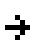

# TI-JS Character Encoding

This is a code generation project for managing character encoding.

If you're not sure what this is, refer first to the [README.md](../README.md) of the TI-JS project.

## Table of contents

- [Overview](#overview)
- [Artifacts](#artifacts)
    - [input](#input)
    - [output](#output)
- [Output format](#output-format)
- [Commands](#commands)

## Overview

The TI-84 graphic calculator (and its siblings) use custom character encoding.
This presents a few challenges, namely:
* There's no obvious way to type or render many of the characters.
* Transferring a program between a calculator and a PC means you can lose data if you're not careful.

This project seeks to fix this by creating a table that maps between TI character encoding and more standard representations.

As an example, the equivalent of an "if statement" is actually represented by a single byte: `0xCE`.
It's renderered as:


In the TI-JS language however, we'll represent it as `&{If }` to disambiguate it from the sequence `I`, `f`, and the space character.

Rather than figure this out by hand, we take existing resources and run them through some simple transformations.
The resulting artifacts will be used by the main TI-JS project.

Resources:
* [parse8xp](https://github.com/Lekensteyn/parse8xp)
* [tiopt, the TI-83 Basic optimizer](https://www.club.cc.cmu.edu/~ajo/ti/tiopt.html)
* [TI-Basic Developer: Tokens and Token Size](http://tibasicdev.wikidot.com/tokens)
* [TI-Basic Developer: TI-83 Plus Large Font](http://tibasicdev.wikidot.com/83lgfont)

## Artifacts

### Input

| File                                | Description |
| ----------------------------------- | ------------|
| [input.csv](./data/input.csv)       | Mostly sourced from `parse8xp`, this is our staring point, a list of hex codes and their nearest ASCII representations. |
| [glyphs.txt](./data/glyphs.txt)     | An list of single-character tokens along with their pixel representation in emoji form.  |
| [unicode.csv](./data/unicode.csv)   | The first thousand unicode characters, mainly to grab their names. |
| [web.txt](./data/web.txt)           | Image URLs sourced from the TI-Basic Developer wiki, used to generate glyphs. |

### Output

| File                                | Description |
| ----------------------------------- | ------------|
| [ENCODING.md](./out/ENCODING.md)    | Human-friendly markdown table where you can see all the tokens. |
| [output.json](./out/output.json)    | Computer-friendly JSON with all the tokens. |
| [sprites.png](./out/sprites.png)    | Large image (425x29485 pixels, but only 167 KB) with all the tokens. Suitable for use as a spritesheet. |
| [sprites/](./out/)                  | Individual images of each token, in png format. Referenced by the markdown table. |

## Output format

Each field of the output is useful in different ways, so let's use these two characters as examples:
```json
{
  "hex": "0x0004",
  "name": "STORE",
  "strict": "&{->}",
  "utf8": "→",
  "length": 1,
  "glyph": "IwAAAAEF8RAA",
  "virtual": false
},
{
  "hex": "0x5D01",
  "name": "LIST_2",
  "strict": "&{L2}",
  "utf8": "L₂",
  "composite": [
    "0x004C", // CAPITAL_L
    "0xBBE2"  // SMALL2
  ],
  "length": 2,
  "virtual": false
},
```

### hex
_Required_

This field represents the byte encoding in the calculator.

```json
// STORE
"hex": "0x0004",

// LIST_2
"hex": "0x5D01",
```

The former is actually stored on the calculator as `0x04`, while the latter is really two bytes.

For simplicity, all characters are treated as being two bytes.
Keep in mind though that different calculators may have different encodings, and what's captured here might not be accurate even for TI-84.

See the `virtual` field for hexes that start with `0xFF`.

### name
_Required_

This field is just a friendly name, and follows these rules:
1. Contains only uppercase letters, numbers, and underscore
2. Starts with an uppercase letter

### strict
_Required_

This field is how the token is represented in TI-JS.

```json
// STORE
"strict": "&{->}",

// LIST_2
"strict": "&{L2}",
```

Each strict token is either:
1. A single character, such as `A`
2. Prefixed by `&{` and suffixed with `}`

There's no way to escape, so here's how you'd translate TI-Basic:
```
Disp "Check out my emoji: &{"
```

To TI-JS:
```
&{Disp }"Check out my emoji: &{amp}{"
```

Note that "strict" implies the existance of "loose": that is, a token string like `->` could be transformed to `&{->}` in some cases, to make writing code easier.

### utf8
_Optional_

This field holds the nearest unicode representation of a token.

```json
// STORE
"utf8": "→",

// LIST_2
"utf8": "L₂",
```

Note that this token may or may not be the same number of characters as the original token.

If this would be the same as strict mode, it's omitted.

### composite
_Optional_

Some tokens are displayed as a string of other tokens. This field captures that as an array of hexes.

```json
// LIST_2
"composite": [
  "0x004C", // CAPITAL_L
  "0xBBE2"  // SMALL2
],
```

Each hex in the array necessarily refers to a single-character token.

When reconstructed, a token may look like:


### length
_Required_

This field is how much space on the screen the token takes up.

```json
// STORE
"length": 1,

// LIST_2
"length": 2
```

For composite tokens, this is the length of their array.

For tokens with glyphs, this is `1`.

### glyph
_Optional_

This field is only for single-character tokens, and represents instructions for how to draw it.

```json
// STORE
"glyph": "IwAAAAEF8RAA"
```

This is a base64 encoding of the image, done in the following way:
1. The first three bytes is an unsigned integer representing the length of the following array.
2. The remaining bits are a boolean array, where `1` means a filled-in pixel.

For the dimensions of the glyphs (7 rows of 5 columns) that means 35 bits. The remaining bits are padding to fill out the last byte. Reconstructing the image requires knowledge of the column width.

Find the algorithm in [src/util/bits.ts](src/util/bits.ts).

Here's an example of how it was constructed:

```sh
# glyphs.txt
⬜⬜⬜⬜⬜
⬜⬜🟦⬜⬜
⬜⬜⬜🟦⬜
🟦🟦🟦🟦🟦
⬜⬜⬜🟦⬜
⬜⬜🟦⬜⬜
⬜⬜⬜⬜⬜

# flattened
⬜⬜⬜⬜⬜⬜⬜🟦⬜⬜⬜⬜⬜🟦⬜🟦🟦🟦🟦🟦⬜⬜⬜🟦⬜⬜⬜🟦⬜⬜⬜⬜⬜⬜⬜

# bits
00000001000001011111000100010000000

# encoded
IwAAAAEF8RAA
```

And then how it may be rendered:



Note that the rendered image has some margins, but that's not included in the bits.

**Note:** so far, only the large font is implemented. There's also the small font (used in the graphing screen) but that's not implmented.

### virtual
_Required_

This is true if this is not a real token per-se, but is used as part of composite tokens.

For example, the first character in this token:


Isn't representable as another token, so we create a "virtual" one with hex `0xFF00`:


In the same vein, the `0xFF01` is extra special and represents glyphs we haven't figured out yet:


## Commands

Make sure you have [node](https://nodejs.org/en/) installed then run:
```sh
npm install
```

You can now then run any of the scripts in [package.json](package.json).
Here's a list of the more useful commands:

| Command                | Description |
| ---------------------- | ------------|
| `npm run bp`           | Build and publish to ./out. Will fail if there are lint errors. |
| `npm run lint:fix`     | Fixes simple lint errors. |

You're unlikely to use the other commands directly, but here they are:

| Command                | Description |
| ---------------------- | ------------|
| `npm run clean`        | Cleans build directory. |
| `npm run build`        | Builds to ./dist. |
| `npm run lint`         | Print lint warnings and errors. Fails if there lint errors. |
| `npm run lint:prod`    | Same as above, fail even on warnings. |
| `npm run b`            | Cleans, builds, and lints. |
| `npm run b:prod`       | Same as above, fail even on lint warnings. |
| `npm run pub:clean`    | Cleans ./out. |
| `npm run pub:sprites`  | Publish sprites to ./out. |
| `npm run pub:table`    | Publish tables to ./out. |
| `npm run pub`          | Publishes everything needed to ./out. |
| `npm run pub:check`    | Fails if ./out has uncommited changes. |
| `npm run pub:prod`     | Publishes to ./out and fails if that would cause a change. |
| `npm run bp:prod`      | Build and publish, and fail if that updates ./out. |
| `npm run web`          | Downloads images from the web and computes glyphs. |