| hex | name | strict | utf8 | composite | sprite |
| - | - | - | - | - | - |
0x0000 | **NULL** | &{null} |  |  | 
0x0001 | **TO_DMS** | &{>DMS} | ⏵DMS | &{arrow}DMS | 
0x0002 | **TO_DEC** | &{>DEC} | ⏵DEC | &{arrow}DEC | 
0x0003 | **TO_FRAC** | &{>FRAC} | ⏵FRAC | &{arrow}FRAC | 
0x0004 | **STORE** | &{->} | → |  | 
0x0005 | **BOXPLOT** | &{Boxplot} |  | Boxplot | 
0x0006 | **LEFT_SQUARE_BRACKET** | [ |  |  | 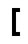
0x0007 | **RIGHT_SQUARE_BRACKET** | ] |  |  | 
0x0008 | **LEFT_CURLY_BRACKET** | { |  |  | 
0x0009 | **RIGHT_CURLY_BRACKET** | } |  |  | 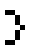
0x000A | **RAD** | &{rad} | ʳ |  | 
0x000B | **DEG** | &{deg} | ° |  | 
0x000C | **INVERT** | &{^-1} | ⁻¹ |  | 
0x000D | **SQUARE** | &{^2} | ² |  | 
0x000E | **TRANSPOSE** | &{transpose} | ᵀ |  | 
0x000F | **CUBE** | &{^3} | ³ |  | 
0x0010 | **LEFT_PARENTHESIS** | ( |  |  | 
0x0011 | **RIGHT_PARENTHESIS** | ) |  |  | 
0x0012 | **ROUND** | &{round(} |  | round( | 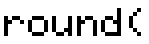
0x0013 | **PXL_TEST** | &{pxl-Test(} |  | pxl-Test( | 
0x0014 | **AUGMENT** | &{augment(} |  | augment( | 
0x0015 | **ROW_SWAP** | &{rowSwap(} |  | rowSwap( | 
0x0016 | **ROW_PLUS** | &{row+(} |  | row+( | 
0x0017 | **ROW_TIMES** | &{*row(} |  | *row( | 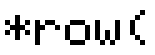
0x0018 | **ROW_TIMES_PLUS** | &{*row+(} |  | *row+( | 
0x0019 | **MAX** | &{max(} |  | max( | 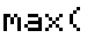
0x001A | **MIN** | &{min(} |  | min( | 
0x001B | **R_TO_PR** | &{R>Pr(} | R⏵Pr( | R&{arrow}Pr( | 
0x001C | **R_TO_PTHETA** | &{R>Ptheta} | R⏵Pθ | R&{arrow}P&{theta} | 
0x001D | **P_TO_RX** | &{P>Rx(} | P⏵Rx( | P&{arrow}Rx( | 
0x001E | **P_TO_RY** | &{P>Ry} | P⏵Ry | P&{arrow}Ry | 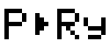
0x001F | **MEDIAN** | &{median(} |  | median( | 
0x0020 | **RAND_M** | &{randM(} |  | randM( | 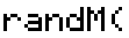
0x0021 | **MEAN** | &{mean(} |  | mean( | 
0x0022 | **SOLVE** | &{solve(} |  | solve( | 
0x0023 | **SEQ** | &{seq(} |  | seq( | 
0x0024 | **FN_INT** | &{fnInt(} |  | fnInt( | 
0x0025 | **N_DERIV** | &{nDeriv(} |  | nDeriv( | 
0x0027 | **F_MIN** | &{fMin(} |  | fMin( | 
0x0028 | **F_MAX** | &{fMax(} |  | fMax( | 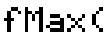
0x0029 | **SPACE** |   |  |  | 
0x002A | **QUOTATION_MARK** | " |  |  | 
0x002B | **COMMA** | , |  |  | 
0x002C | **CONSTANT_I** | &{i} |  |  | 
0x002D | **EXCLAMATION_MARK** | ! |  |  | 
0x002E | **CUBIC_REG** | &{CubicReg} |  | CubicReg | 
0x002F | **QUART_REG** | &{QuartReg} |  | QuartReg | 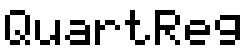
0x0030 | **DIGIT_ZERO** | 0 |  |  | 
0x0031 | **DIGIT_ONE** | 1 |  |  | 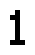
0x0032 | **DIGIT_TWO** | 2 |  |  | 
0x0033 | **DIGIT_THREE** | 3 |  |  | 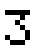
0x0034 | **DIGIT_FOUR** | 4 |  |  | 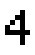
0x0035 | **DIGIT_FIVE** | 5 |  |  | 
0x0036 | **DIGIT_SIX** | 6 |  |  | 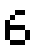
0x0037 | **DIGIT_SEVEN** | 7 |  |  | 
0x0038 | **DIGIT_EIGHT** | 8 |  |  | 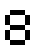
0x0039 | **DIGIT_NINE** | 9 |  |  | 
0x003A | **FULL_STOP** | . |  |  | 
0x003B | **E_TEN** | &{E} |  |  | 
0x003C | **OR** | &{ or } |  |  or  | 
0x003D | **XOR** | &{ xor } |  |  xor  | 
0x003E | **COLON** | : |  |  | 
0x003F | **NEWLINE** | &{newline} |  |  | 
0x0040 | **AND** | &{ and } |  |  and  | 
0x0041 | **CAPITAL_A** | A |  |  | 
0x0042 | **CAPITAL_B** | B |  |  | 
0x0043 | **CAPITAL_C** | C |  |  | 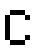
0x0044 | **CAPITAL_D** | D |  |  | 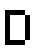
0x0045 | **CAPITAL_E** | E |  |  | 
0x0046 | **CAPITAL_F** | F |  |  | 
0x0047 | **CAPITAL_G** | G |  |  | 
0x0048 | **CAPITAL_H** | H |  |  | 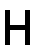
0x0049 | **CAPITAL_I** | I |  |  | 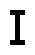
0x004A | **CAPITAL_J** | J |  |  | 
0x004B | **CAPITAL_K** | K |  |  | 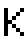
0x004C | **CAPITAL_L** | L |  |  | 
0x004D | **CAPITAL_M** | M |  |  | 
0x004E | **CAPITAL_N** | N |  |  | 
0x004F | **CAPITAL_O** | O |  |  | 
0x0050 | **CAPITAL_P** | P |  |  | 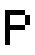
0x0051 | **CAPITAL_Q** | Q |  |  | 
0x0052 | **CAPITAL_R** | R |  |  | 
0x0053 | **CAPITAL_S** | S |  |  | 
0x0054 | **CAPITAL_T** | T |  |  | 
0x0055 | **CAPITAL_U** | U |  |  | 
0x0056 | **CAPITAL_V** | V |  |  | 
0x0057 | **CAPITAL_W** | W |  |  | 
0x0058 | **CAPITAL_X** | X |  |  | 
0x0059 | **CAPITAL_Y** | Y |  |  | 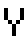
0x005A | **CAPITAL_Z** | Z |  |  | 
0x005B | **THETA** | &{theta} | θ |  | 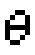
0x005F | **PRGM** | &{prgm} |  | prgm | 
0x0064 | **RADIAN** | &{Radian} |  | Radian | 
0x0065 | **DEGREE** | &{Degree} |  | Degree | 
0x0066 | **NORMAL** | &{Normal} |  | Normal | 
0x0067 | **SCI** | &{Sci} |  | Sci | 
0x0068 | **ENG** | &{Eng} |  | Eng | 
0x0069 | **FLOAT** | &{Float} |  | Float | 
0x006A | **EQUALS_SIGN** | = |  |  | 
0x006B | **LESS_THAN_SIGN** | < |  |  | 
0x006C | **GREATER_THAN_SIGN** | > |  |  | 
0x006D | **LESS_EQUAL** | &{<=} | ≤ |  | 
0x006E | **GREATER_EQUAL** | &{>=} | ≥ |  | 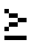
0x006F | **NOT_EQUAL** | &{!=} | ≠ |  | 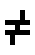
0x0070 | **PLUS_SIGN** | + |  |  | 
0x0071 | **SUBTRACT** | - |  |  | 
0x0072 | **ANS** | &{Ans} |  | Ans | 
0x0073 | **FIX** | &{Fix} |  | Fix | 
0x0074 | **HORIZ** | &{Horiz} |  | Horiz | 
0x0075 | **FULL** | &{Full} |  | Full | 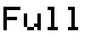
0x0076 | **FUNC** | &{Func} |  | Func | 
0x0077 | **PARAM** | &{Param} |  | Param | 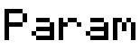
0x0078 | **POLAR** | &{Polar} |  | Polar | 
0x0079 | **SEQ_MODE** | &{Seq} |  | Seq | 
0x007A | **INDPNT_AUTO** | &{IndpntAuto} |  | IndpntAuto | 
0x007B | **INDPNT_ASK** | &{IndpntAsk} |  | IndpntAsk | 
0x007C | **DEPEND_AUTO** | &{DependAuto} |  | DependAuto | 
0x007D | **DEPEND_ASK** | &{DependAsk} |  | DependAsk | 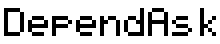
0x007F | **BOX_MARK** | &{square} | □ |  | 
0x0080 | **PLUS_MARK** | &{plus} | ﹢ |  | 
0x0081 | **DOT_MARK** | &{dot} | · |  | 
0x0082 | **ASTERISK** | * |  |  | 
0x0083 | **SOLIDUS** | / |  |  | 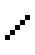
0x0084 | **TRACE** | &{Trace} |  | Trace | 
0x0085 | **CLR_DRAW** | &{ClrDraw} |  | ClrDraw | 
0x0086 | **ZSTANDARD** | &{ZStandard} |  | ZStandard | 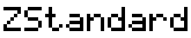
0x0087 | **ZTRIG** | &{ZTrig} |  | ZTrig | 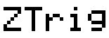
0x0088 | **ZBOX** | &{ZBox} |  | ZBox | 
0x0089 | **ZOOM_IN** | &{Zoom In} |  | Zoom In | 
0x008A | **ZOOM_OUT** | &{Zoom Out} |  | Zoom Out | 
0x008B | **ZSQUARE** | &{ZSquare} |  | ZSquare | 
0x008C | **ZINTEGER** | &{ZInteger} |  | ZInteger | 
0x008D | **ZPREVIOUS** | &{ZPrevious} |  | ZPrevious | 
0x008E | **ZDECIMAL** | &{ZDecimal} |  | ZDecimal | 
0x008F | **ZOOM_STAT** | &{ZoomStat} |  | ZoomStat | 
0x0090 | **ZOOM_RCL** | &{ZoomRcl} |  | ZoomRcl | 
0x0092 | **ZOOM_STO** | &{ZoomSto} |  | ZoomSto | 
0x0093 | **TEXT** | &{Text(} |  | Text( | 
0x0094 | **N_PR** | &{ nPr } |  |  nPr  | 
0x0095 | **N_CR** | &{ nCr } |  |  nCr  | 
0x0096 | **FN_ON** | &{FnOn } |  | FnOn  | 
0x0097 | **FN_OFF** | &{FnOff } |  | FnOff  | 
0x0098 | **STORE_PIC** | &{StorePic } |  | StorePic  | 
0x0099 | **RECALL_PIC** | &{RecallPic } |  | RecallPic  | 
0x009A | **STORE_GDB** | &{StoreGDB } |  | StoreGDB  | 
0x009B | **RECALL_GDB** | &{RecallGDB } |  | RecallGDB  | 
0x009C | **LINE** | &{Line(} |  | Line( | 
0x009D | **VERTICAL** | &{Vertical } |  | Vertical  | 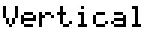
0x009E | **PT_ON** | &{Pt-On(} |  | Pt-On( | 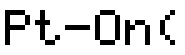
0x009F | **PT_OFF** | &{Pt-Off(} |  | Pt-Off( | 
0x00A0 | **PT_CHANGE** | &{Pt-Change(} |  | Pt-Change( | 
0x00A1 | **PXL_ON** | &{Pxl-On(} |  | Pxl-On( | 
0x00A2 | **PXL_OFF** | &{Pxl-Off(} |  | Pxl-Off( | 
0x00A3 | **PXL_CHANGE** | &{Pxl-Change(} |  | Pxl-Change( | 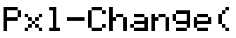
0x00A4 | **SHADE** | &{Shade(} |  | Shade( | 
0x00A5 | **CIRCLE** | &{Circle(} |  | Circle( | 
0x00A6 | **HORIZONTAL** | &{Horizontal } |  | Horizontal  | 
0x00A7 | **TANGENT** | &{Tangent(} |  | Tangent( | 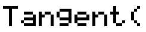
0x00A8 | **DRAW_INV** | &{DrawInv } |  | DrawInv  | 
0x00A9 | **DRAW_F** | &{DrawF } |  | DrawF  | 
0x00AB | **RAND** | &{rand} |  | rand | 
0x00AC | **PI** | &{pi} | π |  | 
0x00AD | **GET_KEY** | &{getKey} |  | getKey | 
0x00AE | **APOSTROPHE** | ' |  |  | 
0x00AF | **QUESTION_MARK** | ? |  |  | 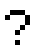
0x00B0 | **NEGATIVE** | &{-} | ˗ |  | 
0x00B1 | **INT** | &{int(} |  | int( | 
0x00B2 | **ABS** | &{abs(} |  | abs( | 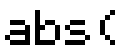
0x00B3 | **DET** | &{det(} |  | det( | 
0x00B4 | **IDENTITY** | &{identity(} |  | identity( | 
0x00B5 | **DIM** | &{dim(} |  | dim( | 
0x00B6 | **SUM** | &{sum(} |  | sum( | 
0x00B7 | **PROD** | &{prod(} |  | prod( | 
0x00B8 | **NOT** | &{not(} |  | not( | 
0x00B9 | **I_PART** | &{iPart(} |  | iPart( | 
0x00BA | **F_PART** | &{fPart(} |  | fPart( | 
0x00BC | **ROOT** | &{root(} | √( | &{root}( | 
0x00BD | **CUBEROOT** | &{cuberoot(} | ∛( | &{3}&{root}( | 
0x00BE | **LN** | &{ln(} |  | ln( | 
0x00BF | **E_RAISE** | &{e^(} |  | &{e}^( | 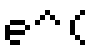
0x00C0 | **LOG** | &{log(} |  | log( | 
0x00C1 | **TEN_RAISE** | &{10^(} | ⏨^( | &{small10}^( | 
0x00C2 | **SIN** | &{sin(} |  | sin( | 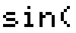
0x00C3 | **ARCSIN** | &{arcsin(} |  | arcsin( | 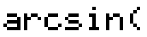
0x00C4 | **COS** | &{cos(} |  | cos( | 
0x00C5 | **ARCCOS** | &{arccos(} |  | arccos( | 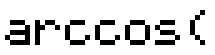
0x00C6 | **TAN** | &{tan(} |  | tan( | 
0x00C7 | **ARCTAN** | &{arctan(} |  | arctan( | 
0x00C8 | **SINH** | &{sinh(} |  | sinh( | 
0x00C9 | **ARCSINH** | &{arcsinh(} |  | arcsinh( | 
0x00CA | **COSH** | &{cosh(} |  | cosh( | 
0x00CB | **ARCCOSH** | &{arccosh(} |  | arccosh( | 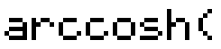
0x00CC | **TANH** | &{tanh(} |  | tanh( | 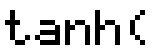
0x00CD | **ARCTANH** | &{arctanh(} |  | arctanh( | 
0x00CE | **IF** | &{If } |  | If  | 
0x00CF | **THEN** | &{Then} |  | Then | 
0x00D0 | **ELSE** | &{Else} |  | Else | 
0x00D1 | **WHILE** | &{While } |  | While  | 
0x00D2 | **REPEAT** | &{Repeat } |  | Repeat  | 
0x00D3 | **FOR** | &{For(} |  | For( | 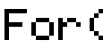
0x00D4 | **END** | &{End} |  | End | 
0x00D5 | **RETURN** | &{Return} |  | Return | 
0x00D6 | **LBL** | &{Lbl } |  | Lbl  | 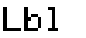
0x00D7 | **GOTO** | &{Goto } |  | Goto  | 
0x00D8 | **PAUSE** | &{Pause } |  | Pause  | 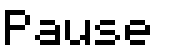
0x00D9 | **STOP** | &{Stop} |  | Stop | 
0x00DA | **INCREMENT_SKIP** | &{IS>(} |  | IS>( | 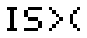
0x00DB | **DECREMENT_SKIP** | &{DS<(} |  | DS<( | 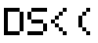
0x00DC | **INPUT** | &{Input } |  | Input  | 
0x00DD | **PROMPT** | &{Prompt } |  | Prompt  | 
0x00DE | **DISP** | &{Disp } |  | Disp  | 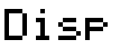
0x00DF | **DISP_GRAPH** | &{DispGraph} |  | DispGraph | 
0x00E0 | **OUTPUT** | &{Output(} |  | Output( | 
0x00E1 | **CLR_HOME** | &{ClrHome} |  | ClrHome | 
0x00E2 | **FILL** | &{Fill(} |  | Fill( | 
0x00E3 | **SORT_A** | &{SortA(} |  | SortA( | 
0x00E4 | **SORT_D** | &{SortD(} |  | SortD( | 
0x00E5 | **DISP_TABLE** | &{DispTable} |  | DispTable | 
0x00E6 | **MENU** | &{Menu(} |  | Menu( | 
0x00E7 | **SEND** | &{Send(} |  | Send( | 
0x00E8 | **GET** | &{Get(} |  | Get( | 
0x00E9 | **PLOTS_ON** | &{PlotsOn } |  | PlotsOn  | 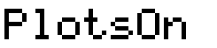
0x00EA | **PLOTS_OFF** | &{PlotsOff } |  | PlotsOff  | 
0x00EB | **LIST** | &{list} | ∟ |  | 
0x00EC | **PLOT1** | &{Plot1(} |  | Plot1( | 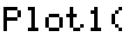
0x00ED | **PLOT2** | &{Plot2(} |  | Plot2( | 
0x00EE | **PLOT3** | &{Plot3(} |  | Plot3( | 
0x00F0 | **RAISE** | ^ |  |  | 
0x00F1 | **X_ROOT** | &{xthroot} | ×√ | &{x}&{root} | 
0x00F2 | **VAR_1_STATS** | &{1-VarStats } |  | 1-VarStats  | 
0x00F3 | **VAR_2_STATS** | &{2-VarStats } |  | 2-VarStats  | 
0x00F4 | **LIN_REG_A_BX** | &{LinReg(a+bx) } |  | LinReg(a+bx)  | 
0x00F5 | **EXP_REG** | &{ExpReg } |  | ExpReg  | 
0x00F6 | **LN_REG** | &{LnReg } |  | LnReg  | 
0x00F7 | **PWR_REG** | &{PwrReg } |  | PwrReg  | 
0x00F8 | **MED_MED** | &{Med-Med } |  | Med-Med  | 
0x00F9 | **QUAD_REG** | &{QuadReg } |  | QuadReg  | 
0x00FA | **CLR_LIST** | &{ClrList } |  | ClrList  | 
0x00FB | **CLR_TABLE** | &{ClrTable} |  | ClrTable | 
0x00FC | **HISTOGRAM** | &{Histogram} |  | Histogram | 
0x00FD | **XY_LINE** | &{xyLine} |  | xyLine | 
0x00FE | **SCATTER** | &{Scatter} |  | Scatter | 
0x00FF | **LIN_REG_AX_B** | &{LinReg(ax+b) } |  | LinReg(ax+b)  | 
0x5C00 | **MATRIX_A** | &{[A]} |  | [A] | 
0x5C01 | **MATRIX_B** | &{[B]} |  | [B] | 
0x5C02 | **MATRIX_C** | &{[C]} |  | [C] | 
0x5C03 | **MATRIX_D** | &{[D]} |  | [D] | 
0x5C04 | **MATRIX_E** | &{[E]} |  | [E] | 
0x5C05 | **MATRIX_F** | &{[F]} |  | [F] | 
0x5C06 | **MATRIX_G** | &{[G]} |  | [G] | 
0x5C07 | **MATRIX_H** | &{[H]} |  | [H] | 
0x5C08 | **MATRIX_I** | &{[I]} |  | [I] | 
0x5C09 | **MATRIX_J** | &{[J]} |  | [J] | 
0x5D00 | **LIST_1** | &{L1} | L₁ | L&{small1} | 
0x5D01 | **LIST_2** | &{L2} | L₂ | L&{small2} | 
0x5D02 | **LIST_3** | &{L3} | L₃ | L&{small3} | 
0x5D03 | **LIST_4** | &{L4} | L₄ | L&{small4} | 
0x5D04 | **LIST_5** | &{L5} | L₅ | L&{small5} | 
0x5D05 | **LIST_6** | &{L6} | L₆ | L&{small6} | 
0x5E10 | **FUNCTION_1** | &{Y1} | Y₁ | Y&{small1} | 
0x5E11 | **FUNCTION_2** | &{Y2} | Y₂ | Y&{small2} | 
0x5E12 | **FUNCTION_3** | &{Y3} | Y₃ | Y&{small3} | 
0x5E13 | **FUNCTION_4** | &{Y4} | Y₄ | Y&{small4} | 
0x5E14 | **FUNCTION_5** | &{Y5} | Y₅ | Y&{small5} | 
0x5E15 | **FUNCTION_6** | &{Y6} | Y₆ | Y&{small6} | 
0x5E16 | **FUNCTION_7** | &{Y7} | Y₇ | Y&{small7} | 
0x5E17 | **FUNCTION_8** | &{Y8} | Y₈ | Y&{small8} | 
0x5E18 | **FUNCTION_9** | &{Y9} | Y₉ | Y&{small9} | 
0x5E19 | **FUNCTION_0** | &{Y0} | Y₀ | Y&{small0} | 
0x5E20 | **X1T** | &{X1T} | X₁┬ | X&{small1}&{smallT1} | 
0x5E21 | **Y1T** | &{Y1T} | Y₁┬ | Y&{small1}&{smallT1} | 
0x5E22 | **X2T** | &{X2T} | X₂┬ | X&{small2}&{smallT1} | 
0x5E23 | **Y2T** | &{Y2T} | Y₂┬ | Y&{small2}&{smallT1} | 
0x5E24 | **X3T** | &{X3T} | X₃┬ | X&{small3}&{smallT1} | 
0x5E25 | **Y3T** | &{Y3T} | Y₃┬ | Y&{small3}&{smallT1} | 
0x5E26 | **X4T** | &{X4T} | X₄┬ | X&{small4}&{smallT1} | 
0x5E27 | **Y4T** | &{Y4T} | Y₄┬ | Y&{small4}&{smallT1} | 
0x5E28 | **X5T** | &{X5T} | X₅┬ | X&{small5}&{smallT1} | 
0x5E29 | **Y5T** | &{Y5T} | Y₅┬ | Y&{small5}&{smallT1} | 
0x5E2A | **X6T** | &{X6T} | X₆┬ | X&{small6}&{smallT1} | 
0x5E2B | **Y6T** | &{Y6T} | Y₆┬ | Y&{small6}&{smallT1} | 
0x5E40 | **POLAR_1** | &{r1} | r₁ | r&{small1} | 
0x5E41 | **POLAR_2** | &{r2} | r₂ | r&{small2} | 
0x5E42 | **POLAR_3** | &{r3} | r₃ | r&{small3} | 
0x5E43 | **POLAR_4** | &{r4} | r₄ | r&{small4} | 
0x5E44 | **POLAR_5** | &{r5} | r₅ | r&{small5} | 
0x5E45 | **POLAR_6** | &{r6} | r₆ | r&{small6} | 
0x5E80 | **FUNC_U** | &{u} |  |  | 
0x5E81 | **FUNC_V** | &{v} |  |  | 
0x5E82 | **FUNC_W** | &{w} |  |  | 
0x6000 | **PIC_1** | &{Pic1} |  | Pic1 | 
0x6001 | **PIC_2** | &{Pic2} |  | Pic2 | 
0x6002 | **PIC_3** | &{Pic3} |  | Pic3 | 
0x6003 | **PIC_4** | &{Pic4} |  | Pic4 | 
0x6004 | **PIC_5** | &{Pic5} |  | Pic5 | 
0x6005 | **PIC_6** | &{Pic6} |  | Pic6 | 
0x6006 | **PIC_7** | &{Pic7} |  | Pic7 | 
0x6007 | **PIC_8** | &{Pic8} |  | Pic8 | 
0x6008 | **PIC_9** | &{Pic9} |  | Pic9 | 
0x6009 | **PIC_0** | &{Pic0} |  | Pic0 | 
0x6100 | **GDB_1** | &{GDB1} |  | GDB1 | 
0x6101 | **GDB_2** | &{GDB2} |  | GDB2 | 
0x6102 | **GDB_3** | &{GDB3} |  | GDB3 | 
0x6103 | **GDB_4** | &{GDB4} |  | GDB4 | 
0x6104 | **GDB_5** | &{GDB5} |  | GDB5 | 
0x6105 | **GDB_6** | &{GDB6} |  | GDB6 | 
0x6106 | **GDB_7** | &{GDB7} |  | GDB7 | 
0x6107 | **GDB_8** | &{GDB8} |  | GDB8 | 
0x6108 | **GDB_9** | &{GDB9} |  | GDB9 | 
0x6109 | **GDB_0** | &{GDB0} |  | GDB0 | 
0x6201 | **STATS_REG_EQ** | &{statsRegEq} |  |  | 
0x6202 | **ITALIC_N** | &{statsn} |  |  | 
0x6203 | **STATS_XBAR** | &{statsxbar} |  |  | 
0x6204 | **STATS_SUMX** | &{statssumx} |  |  | 
0x6205 | **STATS_SUMX_SQUARED** | &{statssumx^2} |  |  | 
0x6206 | **STATS_SX** | &{statsSx} |  |  | 
0x6207 | **STATS_SIGMAX** | &{statssigmax} |  |  | 
0x6208 | **STATS_MIN_X** | &{statsminX} |  |  | 
0x6209 | **STATS_MAX_X** | &{statsmaxX} |  |  | 
0x620A | **STATS_MIN_Y** | &{statsminY} |  |  | 
0x620B | **STATS_MAX_Y** | &{statsmaxY} |  |  | 
0x620C | **STATS_YBAR** | &{statsybar} |  |  | 
0x620D | **STATS_SUMY** | &{statssumy} |  |  | 
0x620E | **STATS_SUMY_SQUARED** | &{statssumy^2} |  |  | 
0x620F | **STATS_SY** | &{statsSy} |  |  | 
0x6210 | **STATS_SIGMAY** | &{statssigmay} |  |  | 
0x6211 | **STATS_SUMXY** | &{statssumxy} |  |  | 
0x6212 | **STATS_R** | &{statsr} |  |  | 
0x6213 | **STATS_MED** | &{statsMed} |  |  | 
0x6214 | **STATS_Q1** | &{statsQ1} |  |  | 
0x6215 | **STATS_Q3** | &{statsQ3} |  |  | 
0x6216 | **STATS_A** | &{statsa} |  |  | 
0x6217 | **STATS_B** | &{statsb} |  |  | 
0x6218 | **STATS_C** | &{statsc} |  |  | 
0x6219 | **STATS_D** | &{statsd} |  |  | 
0x621A | **STATS_E** | &{statse} |  |  | 
0x621B | **STATS_X1** | &{statsx1} |  |  | 
0x621C | **STATS_X2** | &{statsx2} |  |  | 
0x621D | **STATS_X3** | &{statsx3} |  |  | 
0x621E | **STATS_Y1** | &{statsy1} |  |  | 
0x621F | **STATS_Y2** | &{statsy2} |  |  | 
0x6220 | **STATS_Y3** | &{statsy3} |  |  | 
0x6221 | **STATS_ETA** | &{statseta} |  |  | 
0x6222 | **STATS_P** | &{statsp} |  |  | 
0x6223 | **STATS_Z** | &{statsz} |  |  | 
0x6224 | **STATS_T** | &{statst} |  |  | 
0x6225 | **STATS_X_SQUARED** | &{statsX^2} | X² |  | 
0x6226 | **STATS_F** | &{statsF} |  |  | 
0x6227 | **STATS_DF** | &{statsdf} |  |  | 
0x6228 | **STATS_PCARAT** | &{statspcarat} |  |  | 
0x6229 | **STATS_PCARAT1** | &{statspcarat1} |  |  | 
0x622A | **STATS_PCARAT2** | &{statspcarat2} |  |  | 
0x622B | **STATS_XBAR1** | &{statsxbar1} |  |  | 
0x622C | **STATS_SX1** | &{statsSx1} |  |  | 
0x622D | **STATS_N1** | &{statsn1} |  |  | 
0x622E | **STATS_XBAR2** | &{statsxbar2} |  |  | 
0x622F | **STATS_SX2** | &{statsSx2} |  |  | 
0x6230 | **STATS_N2** | &{statsn2} |  |  | 
0x6231 | **STATS_SXP** | &{statsSxp} |  |  | 
0x6232 | **STATS_LOWER** | &{statslower} |  |  | 
0x6233 | **STATS_UPPER** | &{statsupper} |  |  | 
0x6234 | **STATS_S** | &{statss} |  |  | 
0x6235 | **STATS_LOWER_R_SQUARED** | &{statsr^2} |  |  | 
0x6236 | **STATS_UPPER_R_SQUARED** | &{statsR^2} |  |  | 
0x6237 | **STATS_FACTORDF** | &{statsFactordf} |  |  | 
0x6238 | **STATS_FACTOR_SS** | &{statsFactorSS} |  |  | 
0x6239 | **STATS_FACTOR_MS** | &{statsFactorMS} |  |  | 
0x623A | **STATS_ERRORDF** | &{statsErrordf} |  |  | 
0x623B | **STATS_ERROR_SS** | &{statsErrorSS} |  |  | 
0x623C | **STATS_ERROR_MS** | &{statsErrorMS} |  |  | 
0x7E00 | **SEQUENTIAL** | &{Sequential} |  | Sequential | 
0x7E01 | **SIMUL** | &{Simul} |  | Simul | 
0x7E02 | **POLAR_GC** | &{PolarGC} |  | PolarGC | 
0x7E03 | **RECT_GC** | &{RectGC} |  | RectGC | 
0x7E04 | **COORD_ON** | &{CoordOn} |  | CoordOn | 
0x7E05 | **COORD_OFF** | &{CoordOff} |  | CoordOff | 
0x7E06 | **CONNECTED** | &{Connected} |  | Connected | 
0x7E07 | **DOT** | &{Dot} |  | Dot | 
0x7E08 | **AXES_ON** | &{AxesOn} |  | AxesOn | 
0x7E09 | **AXES_OFF** | &{AxesOff} |  | AxesOff | 
0x7E0A | **GRID_ON** | &{GridOn} |  | GridOn | 
0x7E0B | **GRID_OFF** | &{GridOff} |  | GridOff | 
0x7E0C | **LABEL_ON** | &{LabelOn} |  | LabelOn | 
0x7E0D | **LABEL_OFF** | &{LabelOff} |  | LabelOff | 
0x7E0E | **WEB** | &{Web} |  | Web | 
0x7E0F | **TIME** | &{Time} |  | Time | 
0x7E10 | **UV_AXES** | &{uvAxes} |  | uvAxes | 
0x7E11 | **UW_AXES** | &{uwAxes} |  | uwAxes | 
0x7E12 | **VW_AXES** | &{vwAxes} |  | vwAxes | 
0xAA00 | **STR1** | &{Str1} |  | Str1 | 
0xAA01 | **STR2** | &{Str2} |  | Str2 | 
0xAA02 | **STR3** | &{Str3} |  | Str3 | 
0xAA03 | **STR4** | &{Str4} |  | Str4 | 
0xAA04 | **STR5** | &{Str5} |  | Str5 | 
0xAA05 | **STR6** | &{Str6} |  | Str6 | 
0xAA06 | **STR7** | &{Str7} |  | Str7 | 
0xAA07 | **STR8** | &{Str8} |  | Str8 | 
0xAA08 | **STR9** | &{Str9} |  | Str9 | 
0xAA09 | **STR0** | &{Str0} |  | Str0 | 
0xBB00 | **NPV** | &{npv(} |  | npv( | 
0xBB01 | **IRR** | &{irr(} |  | irr( | 
0xBB02 | **BAL** | &{bal(} |  | bal( | 
0xBB03 | **SUMPRN** | &{sumprn(} |  | sumprn( | 
0xBB04 | **SUM_INT** | &{sumInt(} |  | sumInt( | 
0xBB05 | **TO_NOM** | &{>Nom(} | ⏵Nom( | &{arrow}Nom( | 
0xBB06 | **TO_EFF** | &{>Eff(} | ⏵Eff( | &{arrow}Eff( | 
0xBB07 | **DBD** | &{dbd(} |  | dbd( | 
0xBB08 | **LCM** | &{lcm(} |  | lcm( | 
0xBB09 | **GCD** | &{gcd(} |  | gcd( | 
0xBB0A | **RAND_INT** | &{randInt(} |  | randInt( | 
0xBB0B | **RAND_BIN** | &{randBin(} |  | randBin( | 
0xBB0C | **SUB** | &{sub(} |  | sub( | 
0xBB0D | **STD_DEV** | &{stdDev(} |  | stdDev( | 
0xBB0E | **VARIANCE** | &{variance(} |  | variance( | 
0xBB0F | **IN_STRING** | &{inString(} |  | inString( | 
0xBB10 | **NORMALCDF** | &{normalcdf(} |  | normalcdf( | 
0xBB11 | **INV_NORM** | &{invNorm(} |  | invNorm( | 
0xBB12 | **TCDF** | &{tcdf(} |  | tcdf( | 
0xBB13 | **X_SQUARED_CDF** | &{X^2cdf(} | X²cdf( | X&{^2}cdf( | 
0xBB14 | **FCDF** | &{Fcdf(} |  | Fcdf( | 
0xBB15 | **BINOMPDF** | &{binompdf(} |  | binompdf( | 
0xBB16 | **BINOMCDF** | &{binomcdf(} |  | binomcdf( | 
0xBB17 | **POISSONPDF** | &{poissonpdf(} |  | poissonpdf( | 
0xBB18 | **POISSONCDF** | &{poissoncdf(} |  | poissoncdf( | 
0xBB19 | **GEOMETPDF** | &{geometpdf(} |  | geometpdf( | 
0xBB1A | **GEOMETCDF** | &{geometcdf(} |  | geometcdf( | 
0xBB1B | **NORMALPDF** | &{normalpdf(} |  | normalpdf( | 
0xBB1C | **TPDF** | &{tpdf(} |  | tpdf( | 
0xBB1D | **X_SQUARED_PDF** | &{X^2pdf(} | X²pdf( | X&{^2}pdf( | 
0xBB1E | **FPDF** | &{Fpdf(} |  | Fpdf( | 
0xBB1F | **RAND_NORM** | &{randNorm(} |  | randNorm( | 
0xBB20 | **TMV_PMT** | &{tmv_Pmt} |  | tmv_Pmt | 
0xBB21 | **TMV_I_PERCENT** | &{tmv_I%} |  | tmv_I% | 
0xBB22 | **TMV_PV** | &{tmv_PV} |  | tmv_PV | 
0xBB23 | **TMV_N** | &{tmv_N} |  | tmv_N | 
0xBB24 | **TMV_FV** | &{tmv_FV} |  | tmv_FV | 
0xBB25 | **CONJ** | &{conj(} |  | conj( | 
0xBB26 | **REAL** | &{real(} |  | real( | 
0xBB27 | **IMAG** | &{imag(} |  | imag( | 
0xBB28 | **ANGLE** | &{angle(} |  | angle( | 
0xBB29 | **CUM_SUM** | &{cumSum(} |  | cumSum( | 
0xBB2A | **EXPR** | &{expr(} |  | expr( | 
0xBB2B | **LENGTH** | &{length(} |  | length( | 
0xBB2C | **DELTA_LIST** | &{deltaList(} |  | deltaList( | 
0xBB2D | **REF** | &{ref(} |  | ref( | 
0xBB2E | **RREF** | &{rref(} |  | rref( | 
0xBB2F | **TO_RECT** | &{>Rect} | ⏵Rect | &{arrow}Rect | 
0xBB30 | **TO_POLAR** | &{>Polar} | ⏵Polar | &{arrow}Polar | 
0xBB31 | **CONSTANT_E** | &{e} |  |  | 
0xBB32 | **SIN_REG** | &{SinReg } |  | SinReg  | 
0xBB33 | **LOGISTIC** | &{Logistic } |  | Logistic  | 
0xBB34 | **LIN_REG_TTEST** | &{LinRegTTest } |  | LinRegTTest  | 
0xBB35 | **SHADE_NORM** | &{ShadeNorm(} |  | ShadeNorm( | 
0xBB36 | **SHADE_T** | &{Shade_t(} |  | Shade_t( | 
0xBB37 | **SHADE_X_SQUARED** | &{ShadeX^2} | ShadeX² | ShadeX&{^2} | 
0xBB38 | **SHADE_F** | &{ShadeF(} |  | ShadeF( | 
0xBB39 | **MATR_TO_LIST** | &{Matr>list(} | Matr⏵list( | Matr&{arrow}list( | 
0xBB3A | **LIST_TO_MATR** | &{List>matr(} | List⏵matr( | List&{arrow}matr( | 
0xBB3B | **Z_TEST** | &{Z-Test(} |  | Z-Test( | 
0xBB3C | **T_TEST** | &{T-Test } |  | T-Test  | 
0xBB3D | **SAMP_2_ZTEST** | &{2-SampZTest(} |  | 2-SampZTest( | 
0xBB3E | **PROP_1_ZTEST** | &{1-PropZTest(} |  | 1-PropZTest( | 
0xBB3F | **PROP_2_ZTEST** | &{2-PropZTest(} |  | 2-PropZTest( | 
0xBB40 | **X_SQUARED__TEST** | &{X^2-Test(} | X²-Test( | X&{^2}-Test( | 
0xBB41 | **ZINTERVAL** | &{ZInterval } |  | ZInterval  | 
0xBB42 | **SAMP_2_ZINT** | &{2-SampZInt(} |  | 2-SampZInt( | 
0xBB43 | **PROP_1_ZINT** | &{1-PropZInt(} |  | 1-PropZInt( | 
0xBB44 | **PROP_2_ZINT** | &{2-PropZInt(} |  | 2-PropZInt( | 
0xBB45 | **GRAPH_STYLE** | &{GraphStyle(} |  | GraphStyle( | 
0xBB46 | **SAMP_2_TTEST** | &{2-SampTTest } |  | 2-SampTTest  | 
0xBB47 | **SAMP_2_FTEST** | &{2-SampFTest } |  | 2-SampFTest  | 
0xBB48 | **TINTERVAL** | &{TInterval } |  | TInterval  | 
0xBB49 | **SAMP_2_TINT** | &{2-SampTInt } |  | 2-SampTInt  | 
0xBB4A | **SET_UP_EDITOR** | &{SetUpEditor } |  | SetUpEditor  | 
0xBB4B | **PMT_END** | &{Pmt_End} |  | Pmt_End | 
0xBB4C | **PMT_BGN** | &{Pmt_Bgn} |  | Pmt_Bgn | 
0xBB4D | **REAL_MODE** | &{Real} |  | Real | 
0xBB4E | **POLAR_MODE** | &{re^thetai} | re^θi | r&{e}^&{theta}i | 
0xBB4F | **RECT_MODE** | &{a+bi} |  | a+bi | 
0xBB50 | **EXPR_ON** | &{ExprOn} |  | ExprOn | 
0xBB51 | **EXPR_OFF** | &{ExprOff} |  | ExprOff | 
0xBB52 | **CLR_ALL_LISTS** | &{ClrAllLists} |  | ClrAllLists | 
0xBB53 | **GET_CALC** | &{GetCalc(} |  | GetCalc( | 
0xBB54 | **DEL_VAR** | &{DelVar } |  | DelVar  | 
0xBB55 | **EQU_TO_STRING** | &{Equ>String(} | Equ⏵String( | Equ&{arrow}String( | 
0xBB56 | **STRING_TO_EQU** | &{String>Equ(} | String⏵Equ( | String&{arrow}Equ( | 
0xBB57 | **CLEAR_ENTRIES** | &{Clear Entries} |  | Clear Entries | 
0xBB58 | **SELECT** | &{Select(} |  | Select( | 
0xBB59 | **ANOVA** | &{ANOVA(} |  | ANOVA( | 
0xBB5A | **MOD_BOXPLOT** | &{ModBoxplot} |  | ModBoxplot | 
0xBB5B | **NORM_PROB_PLOT** | &{NormProbPlot} |  | NormProbPlot | 
0xBB64 | **G_T** | &{G-T} |  | G-T | 
0xBB65 | **ZOOM_FIT** | &{ZoomFit} |  | ZoomFit | 
0xBB66 | **DIAGNOSTIC_ON** | &{DiagnosticOn} |  | DiagnosticOn | 
0xBB67 | **DIAGNOSTIC_OFF** | &{DiagnosticOff} |  | DiagnosticOff | 
0xBB68 | **ARCHIVE** | &{Archive } |  | Archive  | 
0xBB69 | **UN_ARCHIVE** | &{UnArchive } |  | UnArchive  | 
0xBB6A | **ASM** | &{Asm(} |  | Asm( | 
0xBB6B | **ASM_COMP** | &{AsmComp(} |  | AsmComp( | 
0xBB6C | **ASM_PRGM** | &{AsmPrgm} |  | AsmPrgm | 
0xBB6D | **COMPILED_ASM** | &{compiled asm} |  | compiled asm | 
0xBB6E | **CAPITAL_A_ACUTE** | &{A_ACUTE} | Á |  | 
0xBB6F | **CAPITAL_A_GRAVE** | &{A_GRAVE} | À |  | 
0xBB70 | **CAPITAL_A_CIRCUMFLEX** | &{A_CIRCUMFLEX} | Â |  | 
0xBB71 | **CAPITAL_A_DIAERESIS** | &{A_DIAERESIS} | Ä |  | 
0xBB72 | **SMALL_A_ACUTE** | &{SMALL_A_ACUTE} | á |  | 
0xBB73 | **SMALL_A_GRAVE** | &{SMALL_A_GRAVE} | à |  | 
0xBB74 | **SMALL_A_CIRCUMFLEX** | &{SMALL_A_CIRCUMFLEX} | â |  | 
0xBB75 | **SMALL_A_DIAERESIS** | &{SMALL_A_DIAERESIS} | ä |  | 
0xBB76 | **CAPITAL_E_ACUTE** | &{E_ACUTE} | É |  | 
0xBB77 | **CAPITAL_E_GRAVE** | &{E_GRAVE} | È |  | 
0xBB78 | **CAPITAL_E_CIRCUMFLEX** | &{E_CIRCUMFLEX} | Ê |  | 
0xBB79 | **CAPITAL_E_DIAERESIS** | &{E_DIAERESIS} | Ë |  | 
0xBB7A | **SMALL_E_ACUTE** | &{SMALL_E_ACUTE} | é |  | 
0xBB7B | **SMALL_E_GRAVE** | &{SMALL_E_GRAVE} | è |  | 
0xBB7C | **SMALL_E_CIRCUMFLEX** | &{SMALL_E_CIRCUMFLEX} | ê |  | 
0xBB7D | **SMALL_E_DIAERESIS** | &{SMALL_E_DIAERESIS} | ë |  | 
0xBB7F | **CAPITAL_I_GRAVE** | &{I_GRAVE} | Ì |  | 
0xBB80 | **CAPITAL_I_CIRCUMFLEX** | &{I_CIRCUMFLEX} | Î |  | 
0xBB81 | **CAPITAL_I_DIAERESIS** | &{I_DIAERESIS} | Ï |  | 
0xBB82 | **SMALL_I_ACUTE** | &{SMALL_I_ACUTE} | í |  | 
0xBB83 | **SMALL_I_GRAVE** | &{SMALL_I_GRAVE} | ì |  | 
0xBB84 | **SMALL_I_CIRCUMFLEX** | &{SMALL_I_CIRCUMFLEX} | î |  | 
0xBB85 | **SMALL_I_DIAERESIS** | &{SMALL_I_DIAERESIS} | ï |  | 
0xBB86 | **CAPITAL_O_ACUTE** | &{O_ACUTE} | Ó |  | 
0xBB87 | **CAPITAL_O_GRAVE** | &{O_GRAVE} | Ò |  | 
0xBB88 | **CAPITAL_O_CIRCUMFLEX** | &{O_CIRCUMFLEX} | Ô |  | 
0xBB89 | **CAPITAL_O_DIAERESIS** | &{O_DIAERESIS} | Ö |  | 
0xBB8A | **SMALL_O_ACUTE** | &{SMALL_O_ACUTE} | ó |  | 
0xBB8B | **SMALL_O_GRAVE** | &{SMALL_O_GRAVE} | ò |  | 
0xBB8C | **SMALL_O_CIRCUMFLEX** | &{SMALL_O_CIRCUMFLEX} | ô |  | 
0xBB8D | **SMALL_O_DIAERESIS** | &{SMALL_O_DIAERESIS} | ö |  | 
0xBB8E | **CAPITAL_U_ACUTE** | &{U_ACUTE} | Ú |  | 
0xBB8F | **CAPITAL_U_GRAVE** | &{U_GRAVE} | Ù |  | 
0xBB90 | **CAPITAL_U_CIRCUMFLEX** | &{U_CIRCUMFLEX} | Û |  | 
0xBB91 | **CAPITAL_U_DIAERESIS** | &{U_DIAERESIS} | Ü |  | 
0xBB92 | **SMALL_U_ACUTE** | &{SMALL_U_ACUTE} | ú |  | 
0xBB93 | **SMALL_U_GRAVE** | &{SMALL_U_GRAVE} | ù |  | 
0xBB94 | **SMALL_U_CIRCUMFLEX** | &{SMALL_U_CIRCUMFLEX} | û |  | 
0xBB95 | **SMALL_U_DIAERESIS** | &{SMALL_U_DIAERESIS} | ü |  | 
0xBB96 | **CAPITAL_C_CEDILLA** | &{C_CEDILLA} | Ç |  | 
0xBB97 | **SMALL_C_CEDILLA** | &{SMALL_C_CEDILLA} | ç |  | 
0xBB98 | **CAPITAL_N_TILDE** | &{N_TILDE} | Ñ |  | 
0xBB99 | **SMALL_N_TILDE** | &{SMALL_N_TILDE} | ñ |  | 
0xBB9A | **ACUTE_ACCENT** | &{ACCENT} | ´ |  | 
0xBB9B | **GRAVE_ACCENT_2** | &{\`} |  |  | 
0xBB9C | **UMLAUT** | &{"} | ¨ |  | 
0xBB9D | **UPSIDE_DOWN_QUESTION_MARK** | &{?} | ¿ |  | 
0xBB9E | **UPSIDE_DOWN_EXCLAMATION_MARK** | &{!} | ¡ |  | 
0xBB9F | **ALPHA** | &{alpha} | α |  | 
0xBBA0 | **BETA** | &{beta} | β |  | 
0xBBA1 | **GAMMA** | &{gamma} | γ |  | 
0xBBA2 | **DELTA** | &{delta} | Δ |  | 
0xBBA3 | **LDELTA** | &{ldelta} | δ |  | 
0xBBA4 | **EPSILON** | &{epsilon} | ε |  | 
0xBBA5 | **LAMBDA** | &{lambda} | λ |  | 
0xBBA6 | **MU** | &{mu} | μ |  | 
0xBBA7 | **XPI** | &{xpi} | π |  | 
0xBBA8 | **RHO** | &{rho} | ρ |  | 
0xBBA9 | **SIGMA** | &{sigma} | Σ |  | 
0xBBAB | **PHI** | &{phi} | φ |  | 
0xBBAC | **OMEGA** | &{omega} | Ω |  | 
0xBBAD | **P_HAT** | &{^p} | p̂ |  | 
0xBBAE | **CHI** | &{chi} | χ |  | 
0xBBAF | **BIG_F** | &{F} |  |  | 
0xBBB0 | **SMALL_A** | a |  |  | 
0xBBB1 | **SMALL_B** | b |  |  | 
0xBBB2 | **SMALL_C** | c |  |  | 
0xBBB3 | **SMALL_D** | d |  |  | 
0xBBB4 | **SMALL_E** | e |  |  | 
0xBBB5 | **SMALL_F** | f |  |  | 
0xBBB6 | **SMALL_G** | g |  |  | 
0xBBB7 | **SMALL_H** | h |  |  | 
0xBBB8 | **SMALL_I** | i |  |  | 
0xBBB9 | **SMALL_J** | j |  |  | 
0xBBBA | **SMALL_K** | k |  |  | 
0xBBBC | **SMALL_L** | l |  |  | 
0xBBBD | **SMALL_M** | m |  |  | 
0xBBBE | **SMALL_N** | n |  |  | 
0xBBBF | **SMALL_O** | o |  |  | 
0xBBC0 | **SMALL_P** | p |  |  | 
0xBBC1 | **SMALL_Q** | q |  |  | 
0xBBC2 | **SMALL_R** | r |  |  | 
0xBBC3 | **SMALL_S** | s |  |  | 
0xBBC4 | **SMALL_T** | t |  |  | 
0xBBC5 | **SMALL_U** | u |  |  | 
0xBBC6 | **SMALL_V** | v |  |  | 
0xBBC7 | **SMALL_W** | w |  |  | 
0xBBC8 | **SMALL_X** | x |  |  | 
0xBBC9 | **SMALL_Y** | y |  |  | 
0xBBCA | **SMALL_Z** | z |  |  | 
0xBBCB | **LSIGMA** | &{lsigma} | σ |  | 
0xBBCC | **SMALL_T1** | &{smallT1} | ᵀ |  | 
0xBBCD | **CAPITAL_I_ACUTE** | &{I_ACUTE} | Í |  | 
0xBBCE | **GARBAGE_COLLECT** | &{GarbageCollect} |  | GarbageCollect | 
0xBBCF | **TILDE** | ~ |  |  | 
0xBBD1 | **COMMERCIAL_AT** | @ |  |  | 
0xBBD2 | **NUMBER_SIGN** | # |  |  | 
0xBBD3 | **DOLLAR_SIGN** | $ |  |  | 
0xBBD4 | **AMPERSAND** | &{amp} | & |  | 
0xBBD5 | **GRAVE_ACCENT** | \` |  |  | 
0xBBD6 | **SEMICOLON** | ; |  |  | 
0xBBD7 | **REVERSE_SOLIDUS** | \ |  |  | 
0xBBD8 | **VERTICAL_LINE** | \| |  |  | 
0xBBD9 | **LOW_LINE** | _ |  |  | 
0xBBDA | **PERCENT_SIGN** | % |  |  | 
0xBBDB | **ELLIPSES** | &{...} | … |  | 
0xBBDC | **ANGLE_SIGN** | &{angle} | ∠ |  | 
0xBBDD | **CAPS_BETA** | &{Beta} | ß |  | 
0xBBDE | **SMALLX1** | &{smallx1} | ₓ |  | 
0xBBDF | **SMALL_T2** | &{smallT2} | ┬ |  | 
0xBBE0 | **SMALL0** | &{small0} | ₀ |  | 
0xBBE1 | **SMALL1** | &{small1} | ₁ |  | 
0xBBE2 | **SMALL2** | &{small2} | ₂ |  | 
0xBBE3 | **SMALL3** | &{small3} | ₃ |  | 
0xBBE4 | **SMALL4** | &{small4} | ₄ |  | 
0xBBE5 | **SMALL5** | &{small5} | ₅ |  | 
0xBBE6 | **SMALL6** | &{small6} | ₆ |  | 
0xBBE7 | **SMALL7** | &{small7} | ₇ |  | 
0xBBE8 | **SMALL8** | &{small8} | ₈ |  | 
0xBBE9 | **SMALL9** | &{small9} | ₉ |  | 
0xBBEA | **SMALL10** | &{small10} | ₁₀ |  | 
0xBBEB | **LEFTARROW** | &{leftarrow} |  |  | 
0xBBEC | **RIGHTARROW** | &{rightarrow} |  |  | 
0xBBED | **UPARROWSMALL** | &{uparrowsmall} |  |  | 
0xBBEE | **DOWNARROWSMALL** | &{downarrowsmall} |  |  | 
0xBBEF | **SMALLX2** | &{smallx2} |  |  | 
0xBBF0 | **INTEGRAL** | &{integral} | ∫ |  | 
0xBBF1 | **UPARROW** | &{uparrow} | ↑ |  | 
0xBBF2 | **DOWNARROW** | &{downarrow} | ↓ |  | 
0xBBF3 | **ROOT_SIGN** | &{root} | √ |  | 
0xBBF4 | **HIGHLIGHTEDEQUALS** | &{highlightedequals} |  |  | 
0xEF00 | **SET_DATE** | &{setDate(} |  | setDate( | 
0xEF01 | **SET_TIME** | &{setTime(} |  | setTime( | 
0xEF02 | **CHECK_TMR** | &{checkTmr(} |  | checkTmr( | 
0xEF03 | **SET_DT_FMT** | &{setDtFmt(} |  | setDtFmt( | 
0xEF04 | **SET_TM_FMT** | &{setTmFmt(} |  | setTmFmt( | 
0xEF05 | **TIME_CNV** | &{timeCnv(} |  | timeCnv( | 
0xEF06 | **DAY_OF_WK** | &{dayOfWk(} |  | dayOfWk( | 
0xEF07 | **GET_DT_STR** | &{getDtStr(} |  | getDtStr( | 
0xEF08 | **GET_TM_STR** | &{getTmStr(} |  | getTmStr( | 
0xEF09 | **GET_DATE** | &{getDate} |  | getDate | 
0xEF0A | **GET_TIME** | &{getTime} |  | getTime | 
0xEF0B | **START_TMR** | &{startTmr} |  | startTmr | 
0xEF0C | **GET_DT_FMT** | &{getDtFmt} |  | getDtFmt | 
0xEF0D | **GET_TM_FMT** | &{getTmFmt} |  | getTmFmt | 
0xEF0E | **IS_CLOCK_ON** | &{isClockOn} |  | isClockOn | 
0xEF0F | **CLOCK_OFF** | &{ClockOff} |  | ClockOff | 
0xEF10 | **CLOCK_ON** | &{ClockOn} |  | ClockOn | 
0xEF11 | **OPEN_LIB** | &{OpenLib(} |  | OpenLib( | 
0xEF12 | **EXEC_LIB** | &{ExecLib} |  | ExecLib | 
0xEF13 | **INV_T** | &{invT(} |  | invT( | 
0xEF14 | **X_SQUARED_GOF_TEST** | &{X^2GOF-Test(} | X²GOF-Test( | X&{^2}GOF-Test( | 
0xEF15 | **LIN_REG_TINT** | &{LinRegTInt} |  | LinRegTInt | 
0xEF16 | **MANUAL_FIT** | &{Manual-Fit} |  | Manual-Fit | 
